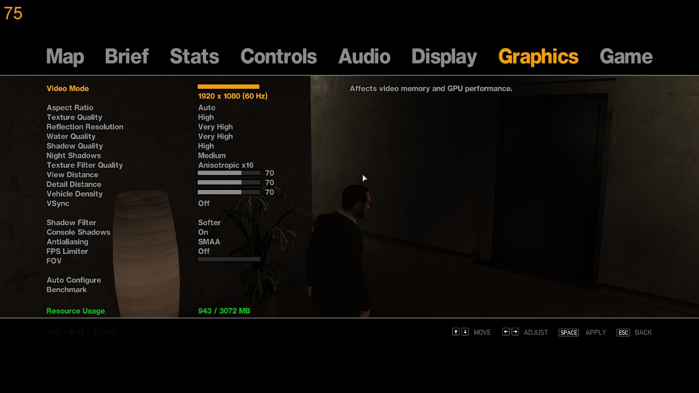

title: Additional Setup
description: Additional setup for your GTA IV installation - after performing the optimization or the drag-and-drop archive

# Additional Setup
Whether you're here after using the [drag-and-drop archive](drag-and-drop-archive.md) or performing the [optimization](optimization.md), we still need to do some setup for the best experience.

## Launch Options
???+ note "How to set the Launch Options?"
    There are two ways to:

    1. For Complete Edition, go to the game's Properties menu in :material-steam:Steam and set them there;
    2. For retail versions, create a :material-file-cog:`commandline.txt` in the game folder and edit it.
???+ tip "Setup Utility"
     [Automatic setup utility](../optimization/#setup-utility) can set up the launch options semi-automatically.

The only options you need to set are: `-norestrictions -nomemrestrict`. All options with values should have a space between the option and the value.

???+ warning "When using DXVK or drag-and-drop archive..."
    * Add `-windowed` to use borderless fullscreen for better stability. Make sure `BorderlessWindowed` is enabled in :material-file-cog:`ZolikaPatch.ini` or/and :material-file-cog:`GTAIV.EFLC.FusionFix.ini` for this to work.
    * Disable `Enable Shader Pre-caching` in `Settings` - `Downloads` on Steam.
    * If the game doesn't show the correct amount of VRAM in the graphics settings (e.g. 512MB), add `-availablevidmem` with the amount of video memory of your GPU with a `.0` after it - up to `3072.0`.
    * If the game doesn't allow you to use the correct resolution/refresh rate, add `-width`, `-height` and `-refreshrate` with your monitor's native values. If it still doesn't help, add `d3d9.forceAspectRatio = 16:9` to :material-file-cog:`dxvk.conf`.

???+ warning "When running on Linux..."
    Perform a [DLL override](https://cookieplmonster.github.io/setup-instructions/#proton-wine) to use either :fontawesome-solid-gears:`dinput8.dll` or :fontawesome-solid-gears:`xlive.dll`.

!!! danger "But other guides use more options!"
    ^^Don't use them^^. They might have helped back in 2009 when the average customer PC couldn't handle precaching and other stuff, but nowadays these options just make things worse or act as a pure placebo. Only add options if a [mod](extras/mods.md) says to add one.

??? abstract "Full list of launch options"
    You can use these options for tweaking, debugging and playing around. The list is taken from the [PCGW page](https://www.pcgamingwiki.com/wiki/Grand_Theft_Auto_IV#Launch_options)

    | Option | Description | 
    | -----: | :---------- |
    | -help | Lists the available commands. |
    | -adapter | Uses the specified screen adapter. |
    | -autoconfig | Automatically adjusts the graphics settings depending on computer specifications. |
    | -availablevidmem | Sets the amount of available physical video memory. |
    | -benchmark | Launches the game in Benchmark mode and then quits it. |
    | -detailquality | Sets the game's detail distance (0-99). |
    | -disableimposters | Turns off imposter rendering for vehicles. |
    | -forcehighqualitymirrors | ? |
    | -forcer2vb | Forces rendering to Vertex Buffer. |
    | -frameLimit | Sets the setting for V-Sync. |
    | -framelockinwindow | Forces framelock to work even in a window. |
    | -fullscreen | Forces fullscreen mode. |
    | -fullspecaudio | Forces high-end CPU audio footprint. |
    | -gpucount | Allows to manually set the GPU count if query fails. |
    | -height | Sets the vertical resolution. |
    | -managed | Uses D3D runtime managed resources. |
    | -memrestrict | Restricts the amount of available memory the game can use. |
    | -minspecaudio | Forces low-end CPU audio footprint. |
    | -no_3GB | Disables 3GB memory support on 32-bit OSes which have been set to allow games and applications to use that much memory. |
    | -noBlockOnLostFocus | Prevents the game from blocking window updates during focus loss. |
    | -noprecache | Disables precaching of resources. |
    | -nomemrestrict | Disables memory restrictions. |
    | -nominimize | Disables the ability to restore the game from minimize and altering resolutions (reduces system memory footprint). |
    | -norestrictions | Disables restrictions on graphics settings. |
    | -noswapdelay | Disables sleep delay before Present (disables the hard present stalls fix). |
    | -notimefix | Disables Time Fix. |
    | -novblank | Disables vertical blanking for V-Sync. |
    | -percentvidmem | Percentage of video memory to be made available for the game. |
    | -refreshrate | Sets the refresh rate (values set must be supported by the monitor used). |
    | -reserve | Sets the amount of memory to be used by other programs. |
    | -reservedApp | Sets the amount of memory to be left available within application space. |
    | -renderquality | Adjusts anisotropic filtering (0-4). |
    | -safemode | Sets the game's graphics to the lowest setting possible. |
    | -shadowdensity | Adjusts night shadows (0-16). |
    | -shadowquality | Sets the shadow quality (0-4). |
    | -stereo | Enables stereo audio support. |
    | -texturequality | Sets the game's texture quality (0-2). |
    | -unmanaged | Uses application managed resources. |
    | -usedirectinput | Allows DirectInput support alongside XInput support. |
    | -viewdistance | Sets the game's view distance (0-99). |
    | -windowed | Forces windowed mode. |
    | -width | Sets the horizontal resolution. |

## Optimal Game Settings
{: style="height:25%;width:25%"; align=right}
!!! note ""
    These settings are optimal for most people. If your PC is weaker - feel free to lower them. If your PC is stronger - feel free to increase them, but don't blame me for the issues.

??? info "Console Settings"
    These settings were set on console versions of the game, and the game is most optimized for them. They are included for having a complete list.
| Setting | Optimal Setting | Console Setting | Description | 
| :-----: | :-------------: | :-----------: | :---------: |
| Video Mode | Your native resolution(max option, usually) | 1280x720 on Xbox 360; 1152x640 on PlayStation 3 | This setting controls your monitor resolution or, if the `-windowed` launch option is set, the size of the game window. |
| Aspect Ratio | Auto | Auto | This setting controls the aspect ratio of the screen relative to the resolution of your monitor. |
| Texture Quality | High | Medium | This setting controls the resolution of all textures. |
| Reflection Resolution | Very High | Medium | This setting controls the resolution of reflections (excluding water reflections). |
| Water Quality | Medium | Medium | This setting controls the density and intensity of waves in the water and water samples, as well as the resolution of water reflections. Medium is recommended as it is less extreme and more realistic. ==With [FusionFix](essential-modding/fusionfix.md), only the reflection resolution is affected.== |
| Shadow Quality | High | Medium | This setting controls the resolution and render distance of shadows. Medium and Low rely much more on static shadows than High. Very High consumes a lot of FPS and may appear broken at times. |
| Night Shadows | Medium or Very High | Off | This setting controls how many local lights (e.g. car headlights) can cast shadows. Each quality level adds 4 additional shadow maps. This setting does not affect the resolution of dynamic shadows. Use [ZolikaPatch](essential-modding/zolikapatch.md) and [FusionFix](essential-modding/fusionfix.md) to fix the artifacts caused by this option, aswell as to be able to enhance this option by adding dynamic shadows to most objects. |
| Texture Filter Quality | Anisotropic 16x | Tri-Linear | This setting controls texture filtering. |
| View Distance | Between 21 and 70 | 21 | This setting controls the main LOD render distance for things like buildings and vehicles. Also affects the render distance for props. Setting it above 70 is known to cause instability and artifacts, as well as a negative impact on framerate. Use [FusionFix](essential-modding/fusionfix.md) to fix the artifacts caused by this option. |
| Detail Distance | Between 10 and 70 | 10 | This setting controls the secondary LOD render distance for props detail. Setting it above 70 is known to cause instability and artifacts. Use [FusionFix](essential-modding/fusionfix.md) to fix the artifacts caused by this option. |
| Vehicle Density | Below 70 | 33 | This setting controls the traffic density. Setting it too high can make driving too much of a hassle, especially with the unstable traffic AI, which can occasionally create random blocks even on straight roads and bridges. |
| Definition | On | Off | ==Skip this if you're using [FusionFix](essential-modding/fusionfix.md).== This setting controls depth of field and motion blur - however, it is also known to cause problems with blurred image on PC and effects that simply do not scale up in resolution - due to that, either keep this option On and lose the effects or install [FusionFix](essential-modding/fusionfix.md) and see the next options instead. Can be quickly toggled by pressing ++p++ button.  |
| VSync | Off | On | This setting controls the vertical synchronization. ==We'll use the one bundled with [DXVK](optimization.md) instead, as it has much better framepacing.== |
| Shadow Filter | Preference | ? | This setting softens the shadows. PCSS makes them behavire more alike to real-life, but can tank your performance.  ==Only available when using [FusionFix](essential-modding/fusionfix.md).==  |
| Console Shadows | On | On | This setting makes shadows behave more console-like - you'll lose the car headlight shadows, but instead the car will have shadows under in-direct light sources (such as light poles).  ==Only available when using [FusionFix](essential-modding/fusionfix.md).==  |
| Antialiasing | SMAA | SSAA 2x on Xbox 360; QAA on PlayStation 3 | This setting controls various methods of anti-aliasing. You can also enable SSAA 2x in `Settings` - `Game`, but keep in mind that it would tank performance in the same way doubling your resolution would. ==Only available when using [FusionFix](essential-modding/fusionfix.md).==  |
| FPS Limiter | 60 | 30 | This setting changes the FPS limit. Recommended to set to 60 to avoid [timing-related issues](https://www.pcgamingwiki.com/wiki/Grand_Theft_Auto_IV#Timing-related_issues), although not necessary and the story can be beaten above 60.  ==Only available when using [FusionFix](essential-modding/fusionfix.md).==  |
| Motion Blur | Preference | On | This setting controls the motion blur effect.  ==Only available in `Settings` - `Display` when using [FusionFix](essential-modding/fusionfix.md).==  |
| Bloom | On | On | This setting controls bloom.  ==Only available in `Settings` - `Display` when using [FusionFix](essential-modding/fusionfix.md).==  |
| Console Gamma | On | On | This setting changes the gamma to match the console-like look.  ==Only available in `Settings` - `Display` when using [FusionFix](essential-modding/fusionfix.md).==  |
| Screen Filter | Default | Default | This setting allows you to switch the timecyc file to match different screen filters (e.g. to have TBoGT filters in IV and vice versa).  ==Only available in `Settings` - `Display` when using [FusionFix](essential-modding/fusionfix.md).==  |
| Distant Blur | Preference | Very High (?) | This setting controls the intensity of the distant blur from the Depth of Field option. The default option on PC is Medium.  ==Only available in `Settings` - `Display` when using [FusionFix](essential-modding/fusionfix.md).==  |
| Depth of Field | On | On | This setting controls depth of field. Highly affects performance.  ==Only available in `Settings` - `Display` when using [FusionFix](essential-modding/fusionfix.md).==  |
| TreeFX | Preference | Console | This setting controls the behaviour of vegetation ambient occlusion. Don't use PC+ unless using custom vegetation mods.  ==Only available in `Settings` - `Display` when using [FusionFix](essential-modding/fusionfix.md).==  |
| Definition | Extra | Classic | Not to be confused with the vanilla Definition setting - however, this one is closer to what it should've been from the start. This setting smoothes out stippled and dithered objects.  ==Only available in `Settings` - `Display` when using [FusionFix](essential-modding/fusionfix.md).==  |

??? question "What is :material-file-cog:`stream.ini`?"
    Other guides often suggest editing :material-file-cog:`stream.ini` to change the values in there from `2048000` to `4096000`. From [PCGW users' observations](https://www.pcgamingwiki.com/w/index.php?title=Topic:X1jmh4mc3t6mv3hv&topic_showPostId=xb5gbd4mggke2ets#flow-post-xb5gbd4mggke2ets), as well as my own - this provides no benefit whatsoever and is likely a placebo.

You can stop here if all you wanted was to improve your performance, however I'd advise going up to install essential mods for best experience.

[:material-page-first:Previous page  Optimization ](optimization.md){ .md-button } [Next page:material-page-last:  Downgrading ](downgrading.md){ .md-button .md-button--primary }