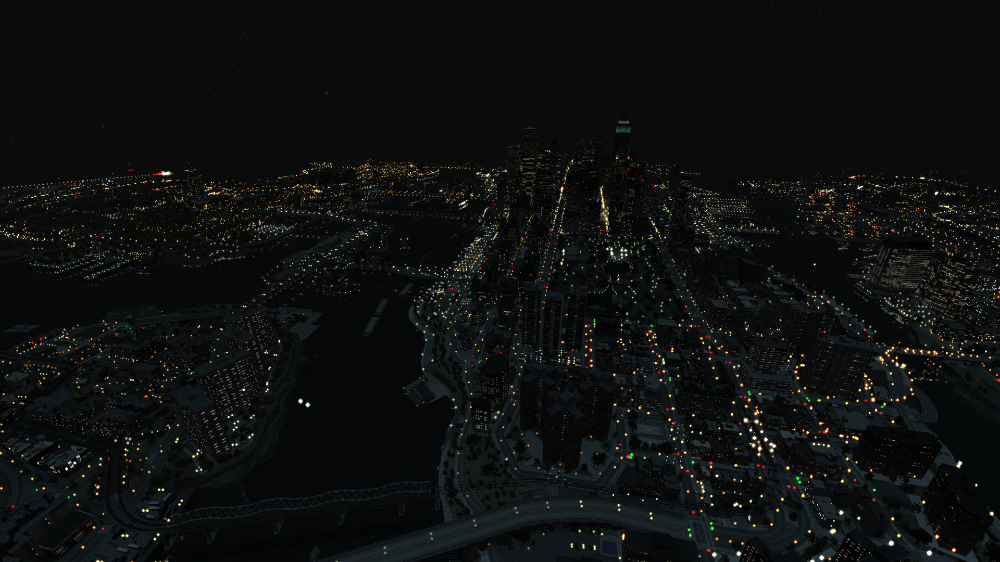

title: Project2DFX
description: One of the nice mods to have for your GTA IV install that improves distant lights at night

# Project2DFX
!!! warning "Compatibility"
    Latest version only supports Complete Edition, but there's an older version with support for 1.0.8.0/1.0.7.0.
This project improves distant lights at night.

## Showcase { data-search-exclude }
{: style="height:40%;width:40%";}
{: style="height:40%;width:40%";}

## Installation { data-search-exclude }
=== "1.0.8.0"
    * Make sure you have [Ultimate ASI Loader](../../mod-dependencies/#ultimate-asi-loader) installed.
    * Download the [v4.3 release](https://github.com/ThirteenAG/III.VC.SA.IV.Project2DFX/releases/download/v0.0/IV.Project2DFXv4.3.zip).
    * Extract :material-zip-box:`IV.Project2DFXv4.3` into the game folder or the :material-folder:==plugins==.
    * Edit :material-file-cog:`IVLodLights.ini` if you're not fully satisfied.
=== "1.2.0.59"
    * Make sure you have [Ultimate ASI Loader](../../mod-dependencies/#ultimate-asi-loader) installed.
    * Go to the [Release](https://github.com/ThirteenAG/III.VC.SA.IV.Project2DFX/releases/tag/gtaiv) page.
    * Download :material-zip-box:`IV.Project2DFX.zip`.
    * Extract :material-zip-box:`IV.Project2DFX.zip` into the game folder or the :material-folder:==plugins==.
    * Edit :material-file-cog:`IVLodLights.ini` if you're not fully satisfied.

[:material-page-first:Previous page  Console Visuals ](consolevisuals.md.md){ .md-button } [Next page:material-page-last:  Extras ](../extras/index.md){ .md-button .md-button--primary }